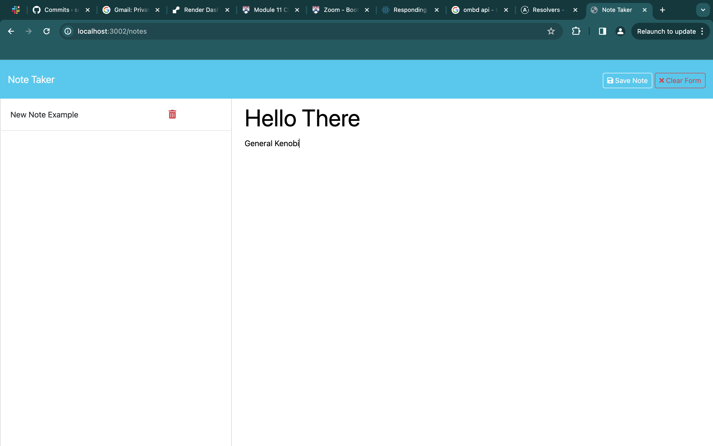

# Note-Taker

## User Story
AS A small business owner
I WANT to be able to write and save notes
SO THAT I can organize my thoughts and keep track of tasks I need to complete

## Installation
This application requires express, Node.js and npm to be installed.

## Usage
To start the application, run the following command in the root directory:
```
npm install
```
Then, run the following command from the root directory to start the server:
```
node server
```
## Mock-Up
